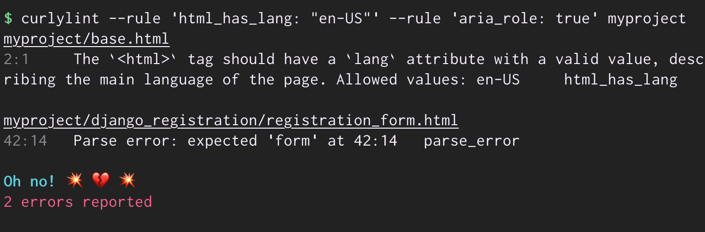

# [curlylint](https://www.curlylint.org/) [](https://www.curlylint.org/)

[](https://pypi.org/project/curlylint/) [](https://pypi.org/project/curlylint/) [](https://travis-ci.com/thibaudcolas/curlylint) [](https://lgtm.com/projects/g/thibaudcolas/curlylint/alerts/)

> **{{ 🎀}}** Experimental HTML templates linting for [Jinja](https://jinja.palletsprojects.com/), [Nunjucks](https://mozilla.github.io/nunjucks/), [Django templates](https://docs.djangoproject.com/en/dev/topics/templates/), [Twig](https://twig.symfony.com/), [Liquid](https://shopify.github.io/liquid/).
> Forked from [jinjalint](https://github.com/motet-a/jinjalint).

## Features

[Curlylint](https://www.curlylint.org/) is an HTML linter for [“curly braces”](https://www.curlylint.org/docs/template-languages) templates, and their HTML. It focuses on [rules](https://www.curlylint.org/docs/rules/all) to check for common accessibility issues.



On the roadmap:

- More checks for common accessibility issues in HTML.
- Checks for common security issues – for exameple `rel="noopener noreferrer"`, or known sources of XSS vulnerabilities.
- More [ideas welcome](https://www.curlylint.org/docs/reference/ideas)!

## Usage

Curlylint is available on [PyPI](<(https://pypi.org/project/curlylint/)>), grab it and you can start linting:

```bash
# Assuming you’re using Python 3.6+,
pip install curlylint
# Now time to lint those templates!
curlylint template-directory/
```

Have a look at our [documentation](https://www.curlylint.org/docs/) to make the most of it:

- [Getting Started](https://www.curlylint.org/)
- [Command Line Usage](https://www.curlylint.org/docs/command-line-usage)
- [Configuration](https://www.curlylint.org/docs/configuration)
- [Template Languages](https://www.curlylint.org/docs/template-languages)
- [Rules](https://www.curlylint.org/docs/rules/all)

## Contributing

See anything you like in here? Anything missing? We welcome all support, whether on bug reports, feature requests, code, design, reviews, tests, documentation, and more. Please have a look at our [contribution guidelines](CONTRIBUTING.md).

If you just want to set up the project on your own computer, the contribution guidelines also contain all of the setup commands.

## Credits

Started as a fork of [jinjalint](https://github.com/motet-a/jinjalint). Image credit: [FxEmojis](https://github.com/mozilla/fxemoji). [Test templates](tests/README.md) extracted from third-party projects. Website hosted by [Netlify](https://www.netlify.com/).

View the full list of [contributors](https://github.com/thibaudcolas/curlylint/graphs/contributors). [MIT](LICENSE) licensed. Website content available as [CC0](https://creativecommons.org/share-your-work/public-domain/cc0/).
